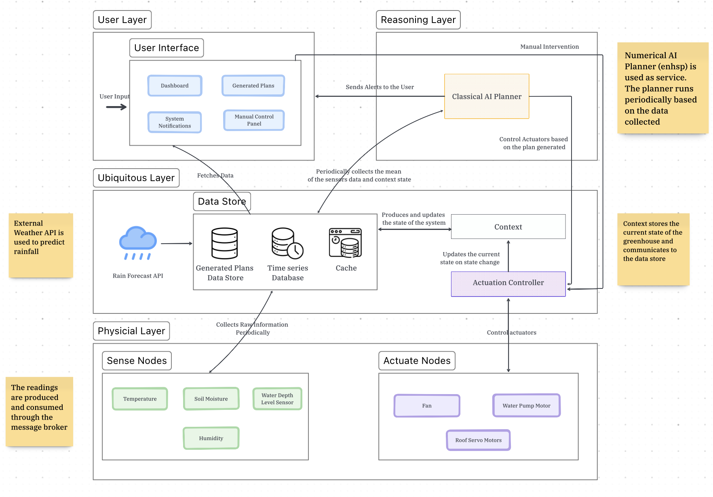

# Smart Greenhouse AI Planning System

This project is a smart greenhouse control and monitoring system using AI planning, indirect communication via RabbitMQ, and a modular Python codebase. The system is split into two main components:

- **Server**: Flask web server for dashboard, control panel, and planning logic (runs on your main computer/server)
- **Client**: Hardware interface and actuator control (runs on a Raspberry Pi inside the greenhouse)

---

## System Architecture



The system is organized into four main layers:

- **User Layer**: Provides a web-based dashboard and control panel for users to monitor the greenhouse, view plans, and send manual commands.
- **Reasoning Layer**: Runs the AI planner, processes plans, and sends alerts. The planner periodically generates new plans based on the latest data.
- **Ubiquitous Layer**: Handles all data storage (sensor readings, plans, cache) and integrates with external weather APIs to fetch rain forecasts. It also manages the context (current state) and actuates commands.
- **Physical Layer**: Contains the actual sensors (temperature, humidity, soil moisture, water level) and actuators (fan, water pump, roof servos) in the greenhouse. The Raspberry Pi client collects sensor data and controls actuators.

Communication between layers is handled via APIs, message queues (RabbitMQ), and Redis for notifications and locking.

---


## PDDL Domain & Dynamic Problem Generation

### Greenhouse Domain Logic (`domain.pddl`)

The `domain.pddl` file encodes the logic and rules for operating the smart greenhouse. It models:

- **Actuators and Sensors**: Fans, servos (roof motors), water pumps, and environmental sensors (temperature, humidity, soil moisture, water tank level).
- **Comfort and Safety Goals**: The planner's objective is to keep the greenhouse comfortable (temperature, humidity, soil moisture within thresholds) and safe (water managed, alerts issued as needed).
- **Actions**: Each actuator has actions (e.g., `turn_on_fan`, `open_roof`, `turn_on_pump`) with:
  - **Preconditions**: When the action is allowed (e.g., only turn on the fan if temperature or humidity is too high).
  - **Effects**: How the action changes the environment (e.g., turning on the fan decreases temperature and humidity, increases energy cost).
- **Assessment and Alerts**: Special actions assess whether comfort goals are met, and issue alerts if water is low or rain is expected.
- **Numeric Fluents**: All sensor readings, thresholds, and costs are modeled as numeric variables, allowing the planner to reason quantitatively.
- **Optimization**: The planner seeks to achieve all comfort and safety goals while minimizing the total cost (energy, water usage, etc.).

**Example Logic:**
- The planner can only open the roof if temperature or humidity is above a threshold. Closing the roof is only allowed when comfort is restored.
- The water pump is only turned on if the soil is dry and there is enough water in the tank.
- Alerts are issued if the water tank is low and rain is not expected soon, or if rain is expected and water management needs to be adjusted.
- The plan is only considered complete when all comfort and safety goals are achieved and all assessments are finalized.

This domain logic allows the AI planner to generate intelligent, context-aware action sequences that keep the greenhouse environment optimal and safe, while minimizing resource usage.

### Dynamic Problem Generation
For each planning cycle, the server dynamically generates a PDDL problem file (`problem.pddl`) using real-time data:
- **Objects**: All relevant actuators, sensors, and alert levels
- **Init**: Numeric fluents (sensor readings, thresholds, config values) and boolean predicates (current actuator states)
- **Goal**: A set of comfort and management goals (e.g., temperature comfortable, water managed)

The problem file is rendered using Jinja2 templates, mapping live data into the PDDL structure. This allows the planner to always work with the latest state of the greenhouse.


### Data Collection & Mapping
- The **Client** collects sensor data (temperature, humidity, soil moisture, water level) and sends it to the server.
- The **Server** stores this data in InfluxDB and PostgreSQL, and fetches the latest values when generating a problem.
- Configuration values (thresholds, durations, etc.) are also fetched from the database.
- The server combines all this information to fill in the PDDL problem template, ensuring the planner's input matches the real greenhouse state.

### Weather Integration in Planning
- The system periodically fetches weather forecasts (especially rain probability) from an external API.
- The forecasted probability of rain is processed to estimate the number of hours until rain is expected (e.g., the first hour where rain probability exceeds a threshold).
- This value (`hours_until_rain`) is stored in the database and included as a numeric fluent in the PDDL problem.
- The planner uses this information to:
  - Decide whether to issue water alerts (e.g., only warn about low water if rain is not expected soon)
  - Optimize water usage (e.g., avoid filling the tank if rain is imminent)
  - Adjust plans for irrigation and roof control based on upcoming weather
- This integration ensures the greenhouse operates efficiently and safely, taking into account both current conditions and predicted weather.

---

## How It Works


- The **Server** provides a web dashboard for monitoring and controlling the greenhouse. It exposes endpoints for sensor data, configuration, and manual control.
- When a user triggers an action (e.g., turn on fan, open roof), the server sends a message to a RabbitMQ queue.
- The **Client** (on the Raspberry Pi) listens to this queue, receives action commands, and interacts with the hardware (fans, servos, pumps, sensors).
- Sensor data is collected by the client and sent to the server for logging and visualization.
- The server uses **Redis** for:
  - Real-time notifications (pushing alerts and updates to the dashboard)
  - Locking mechanisms (to prevent race conditions and ensure safe concurrent operations)
- All configuration and state constants are shared via a single `shared/state_constants.py` file.

This indirect communication (decoupling) via RabbitMQ (and Redis for notifications/locking) allows the server and client to run independently, even on different machines or networks.
## Redis Usage (Server)

- The server uses Redis for two main purposes:
  1. **Notifications**: Real-time alerts and updates are pushed to the dashboard using Redis pub/sub or as a fast in-memory store.
  2. **Locking**: Redis is used to implement distributed locks, ensuring that only one process or thread can perform certain critical operations at a time (e.g., actuator commands, config updates).

- Make sure Redis is running and accessible before starting the server.

---

---

## Server Setup & Usage

### Prerequisites
- Python 3.9+
- PostgreSQL
- RabbitMQ
- (Recommended) Create a virtual environment

### Install Dependencies
```
cd Server
pip install -r requirements.txt
```

### Database Setup
1. Start PostgreSQL and RabbitMQ services.
2. Create the database and tables:
   ```
   python ../createdb.py
   ```
   (This will also initialize default configs.)

### Run the Server
```
cd Server
python -m run
```
- The web dashboard will be available at `http://localhost:5000`.

---

## Client (Raspberry Pi) Setup & Usage

### Prerequisites
- Raspberry Pi OS (with GPIO support)
- Python 3.9+
- RabbitMQ server accessible from the Pi
- All hardware (fans, servos, sensors) connected to the correct GPIO pins

### Install Dependencies
```
cd Client
pip install -r requirements.txt
```

### Configure GPIO Pins
- Edit `Client/app/config.py` to match your hardware wiring (e.g., `SERVO_1_GPIO`, `SERVO_2_GPIO`)

### Run the Client
```
cd Client/app
python client.py
```
- The client will connect to RabbitMQ, listen for commands, and control the hardware accordingly.

---

## Indirect Communication (RabbitMQ)

- The server and client do **not** communicate directly.
- The server sends action commands (as JSON) to a RabbitMQ queue (e.g., `planner_queue`).
- The client subscribes to this queue, receives commands, and executes them on the hardware.
- This architecture allows for robust, decoupled, and scalable operation.

---

## Directory Structure

```
smartcities_ai_planning_greenhouse/
├── Server/           # Flask server, planning logic, dashboard
├── Client/           # Raspberry Pi client, hardware modules
├── shared/           # Shared constants and code
├── createdb.py       # Database/table/config initialization
```

---

## Troubleshooting
- Ensure RabbitMQ and PostgreSQL are running and accessible from both server and client.
- If you get `ModuleNotFoundError: No module named 'shared'`, make sure you are running scripts from the correct directory, or check the sys.path logic in `state_constants.py`.
- For hardware issues (e.g., servo jitter), see the comments in the relevant module.

---

## Authors
- Cyrus Jackson

---

## License
MIT License